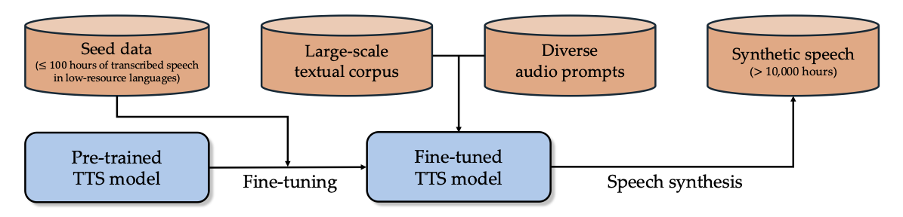
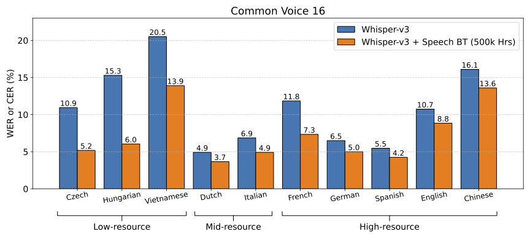

# Scaling Back-Translation for Speech Recognition

## Speech Back-Translation
Recent advances in Automatic Speech Recognition (ASR) have been largely fueled by the availability of massive datasets. However, extending coverage to diverse languages with limited resources remains a formidable challenge.
This paper introduces **Speech Back-Translation**, a technique that improves ASR models by converting large-scale text corpora into synthetic speech via text-to-speech (TTS) models.
We demonstrate that just tens of hours of transcribed speech can effectively train TTS models to generate synthetic speech at hundreds of times the original volume while maintaining high quality.
<p align="center">
     <br>
    The pipeline of Speech Back-Translation.
</p>

## Multilingual ASR Performance
Using this approach, we augment limited transcribed real speech with more than 500,000 hours of synthetic speech across ten languages and continue pre-training Whisper-large-v3, a state-of-the-art multilingual ASR model.
Our results demonstrate significant performance gains—over 30\% improvement on average—highlighting the scalability and effectiveness of Speech Back-Translation for strengthening multilingual ASR models.

<p align="center">
     <br>
</p>

## Setup
Please follow the following steps before running our code.
1. Use Conda to create a Python virtual environment
```
conda create -n speech-bt python=3.10
conda activate speech-bt
```
2. Install torch and other Python dependencies
```
conda install pytorch==2.1.2 torchaudio==2.1.2 pytorch-cuda=11.8 -c pytorch -c nvidia
pip install -r requirements.txt
```
3. Loggin to huggingface for downloading pre-trained model weights
```
huggingface-cli login --token "${your_hf_token}"
```
4. Download TTS model
```
huggingface-cli download coqui/XTTS-v2 --local-dir xtts_ckpt/
```

## Generate Synthetic Speech Dataset
Run the following command to synthesize speech from textual corpus:
```bash
cd gen_audio/
export SYNDATA_PATH='.'
TEXT_NAME="${text_name}"
LANG="${language}"
CUDA_VISIBLE_DEVICES=0 python infer.py --text_name $TEXT_NAME --lang $LANG
```
- `SYNDATA_PATH`: path to synthetic speech dataset
- `TEXT_NAME`: textual corpus name
- `LANG`: Specify language for TTS model

Then organize the synthetic speech as well as transcripts into a `huggingface` dataset.
```bash
cp dataloading_script.py $SYNDATA_PATH/syndata/$LANG/$TEXT_NAME/$TEXT_NAME.py

sed -i "7s|DATA_NAME = '<LANG>/<TEXT_NAME>'|DATA_NAME = '$LANG/$TEXT_NAME'|" $SYNDATA_PATH/syndata/$LANG/$TEXT_NAME/$TEXT_NAME.py

python test_loading.py --lang $LANG --text_name $TEXT_NAME
```

We also prepare a all-in-one script for running speech synthesis in a multi-gpu environment.
```bash
cd gen_audio/
bash run.sh "${text_path}" "${language}"
```
Notice that this script assumes a standard 8-gpu setup. Change it to fit your environment accordingly.


## Acknowledgement
This repo is largely inspired by [coqui-ai/TTS](https://github.com/coqui-ai/TTS). We are grateful to the authors for their brilliant work.